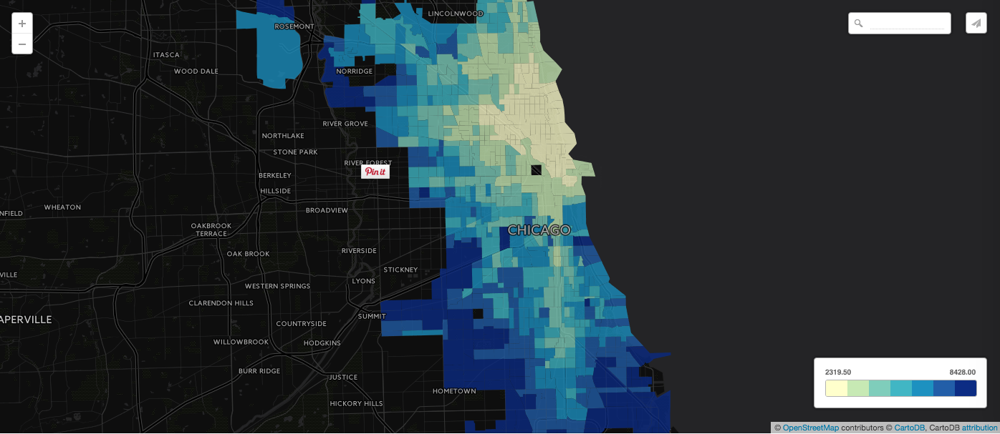
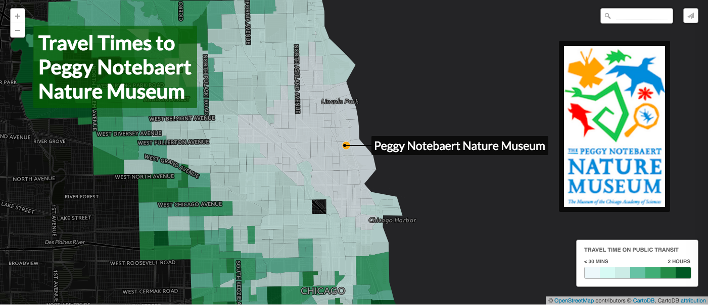

## mapping hives HCB-2016
[project] Hive Chicago Buzz asset mapping working group

### maps

1. [time travel adler map](https://team.cartodb.com/u/stuartlynn/viz/1a274992-c211-11e5-bc5e-0e3ff518bd15/public_map)

2.  [time travel peggy map](https://team.cartodb.com/u/stuartlynn/viz/75814c8e-c211-11e5-962a-0ea31932ec1d/public_map)

### participants

* Sonju
* Allison
* Stuart
* Aurelia
* David
* Chris
* Peter
* Jonathan
* Subakar

### goals

* getting young people connected to programs
* mapping assets: time map, transit, prioritization
* building narrative: telling stories
* mapping un-official spaces
* mapping events: for hive networks, publicizing those events
* building visibility: hive can see knowledge centers of a neighborhood

### share out

**A brief summary of your topic or goal.**

Our goal was to work on mapping Hive Chicago Network activity and assets to promote a more 

**A summary of what you produced today.**

* Stuart and Jonathan worked on a census tracking map, and travel time prototype to assess
* They also used the Google Routing API to pull in information about travel times between service locations and hive programs. Mostly in an effort to promote events accross programs and deterine the feasibility of projects by population travel time distances
* Some of the team played around with some mapping tools, learning about CartoDB and other open source mapping resources.
* Some of the team traveled as ambassadors to other teams to learn more about how we might cross-pollinate mapping projects

**One word or image from each group member describing how they felt about the day.**

**A list of any topics you wanted to discuss but didn't have time for.**

We tried to send ambassadors to visit other projects with similar interests, or cross-over possibliities in mapping.
